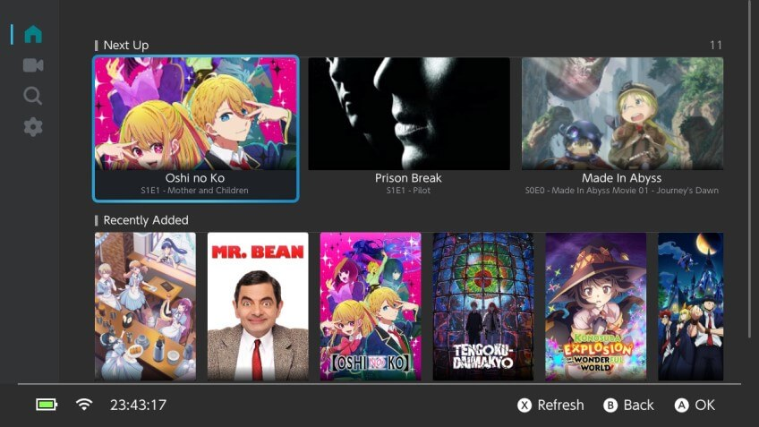
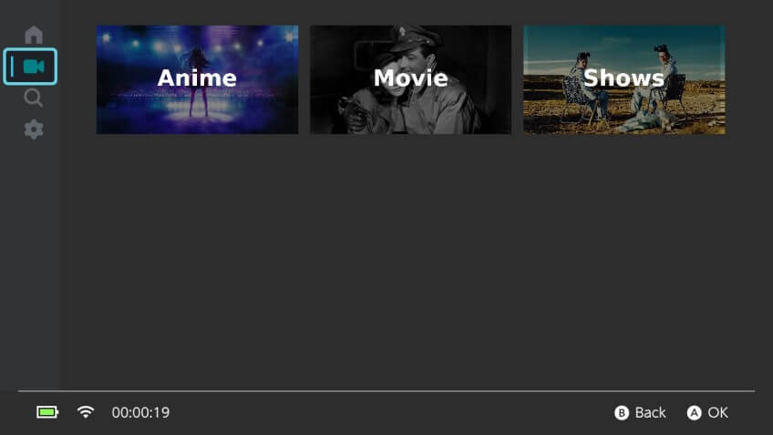
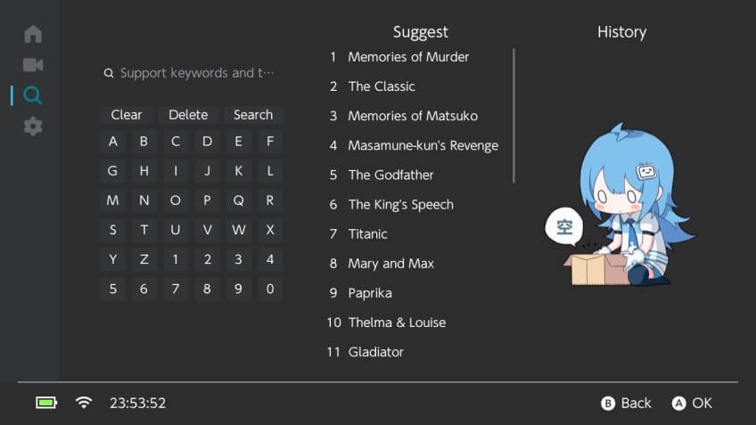
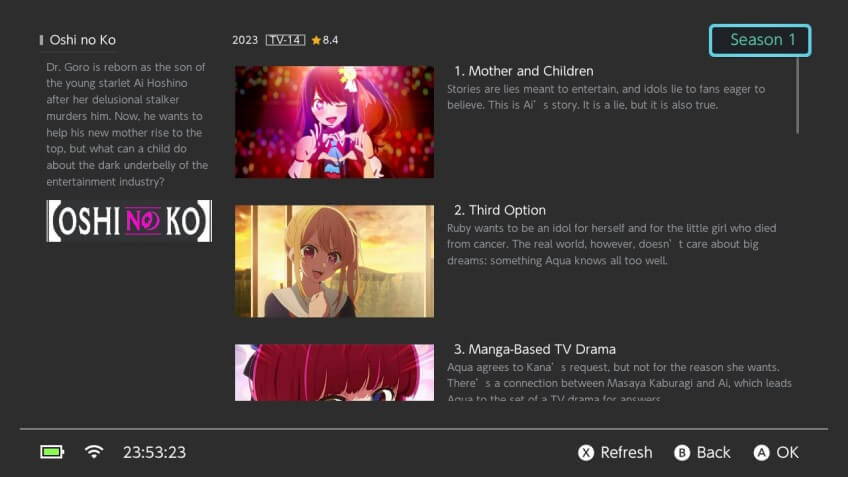
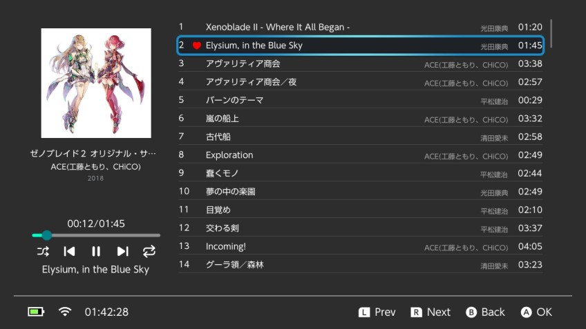

# Switchfin


Switchfin is third-party PC player for Jellyfin that provides a native user interface to browse and play movies and series.
<br>

[](https://github.com/dragonflylee/switchfin/actions/workflows/build.yaml) [](https://github.com/dragonflylee/switchfin/releases/latest) [](https://nightly.link/dragonflylee/switchfin/workflows/build.yaml/dev)

**This project is in its early stages so expect bugs.**

## Screenshots
| Home                                | Library                             |
|-------------------------------------|-------------------------------------|
|  |  | 
| Search | Episode |
|  |  |
| Music | |
|  | |

## Features
- Completely native interface
- Supported media items: movies, series, seasons, episodes 
  - Direct play and transcoding
- Base on MPV Player
  - Container formats: mkv, mov, mp4, avi
  - Video codecs: H.264, H.265, VP8, VP9, AV1
  - Audio codecs: Opus, FLAC, MP3, AAC, AC-3, E-AC-3, TrueHD, DTS, DTS-HD
  - Subtitle codecs: SRT, VTT, SSA/ASS, DVDSUB
  - Optionally force software decoding when hardware decoding has issues.

## Input mapping during playback

- A Play/Pause
- B Stop during
- Y Toggle OSD
- X Show Menu 
- R/L Seek +/-
- L Stick Button Toggle Speed Select
- R Stick Button Toggle Video Quality Select
- \+ Show video profile

## FAQ

1. Q: Subtitles didn't display? A: Put any ttf file at `/switch/Switchfin/subfont.ttf`

## TODO list

- [ ] Movie view
- [ ] Series detail
- [x] Search page
- [ ] Websocket connection (Syncplay)
- [x] [danmu plugin](https://github.com/cxfksword/jellyfin-plugin-danmu) integration

## Develop

```shell
git clone https://github.com/dragonflylee/switchfin.git --recurse-submodules --shallow-submodules
```

### Building for Switch

To build for Switch, a standard development environment must first be set up. In order to do so, [refer to the Getting Started guide](https://devkitpro.org/wiki/Getting_Started).

```bash
sudo dkp-pacman -S switch-dev switch-glfw switch-libwebp switch-curl
cmake -B build_switch -DPLATFORM_SWITCH=ON -DBUILTIN_NSP=ON
make -C build_switch Switchfin.nro -j$(nproc)
# for debug
nxlink -a <YOUR IP> -p Switchfin/Switchfin.nro -s Switchfin.nro --args -d -v
```

### Building for MinGW64

```bash
pacman -S ${MINGW_PACKAGE_PREFIX}-cc ${MINGW_PACKAGE_PREFIX}-ninja ${MINGW_PACKAGE_PREFIX}-cmake
cmake -B build_mingw -G Ninja -DPLATFORM_DESKTOP=ON
cmake --build build_mingw
```

## Thanks to

- **@xfangfang for [wiliwili](https://github.com/xfangfang/wiliwili)**
- @devkitpro and switchbrew for [libnx](https://github.com/switchbrew/libnx)
- @natinusala and XITRIX for [borealis](https://github.com/natinusala/borealis)
- @proconsule for [nxmp](https://github.com/proconsule/nxmp)
- @averne for great work of [FFmpeg](https://github.com/averne/FFmpeg) hwaccel backend 
