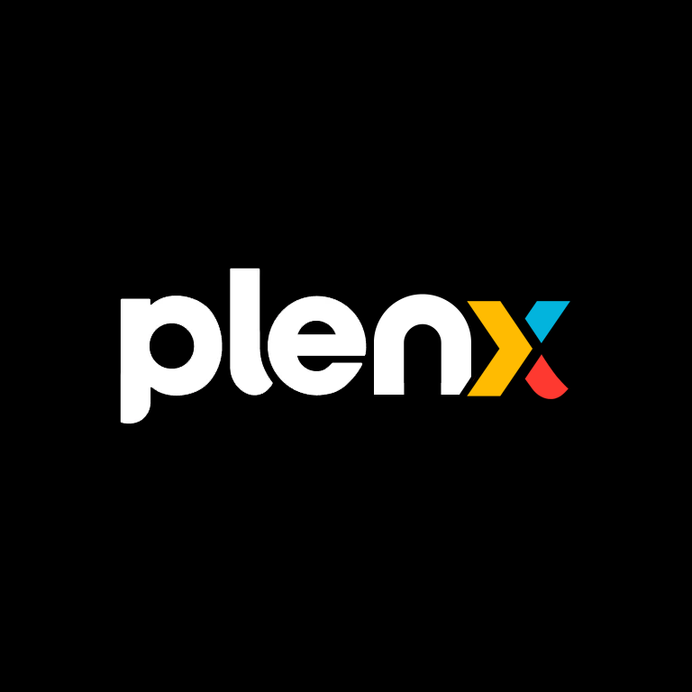
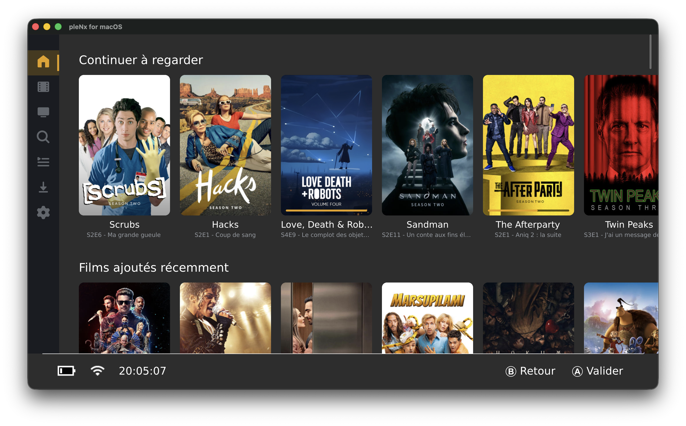
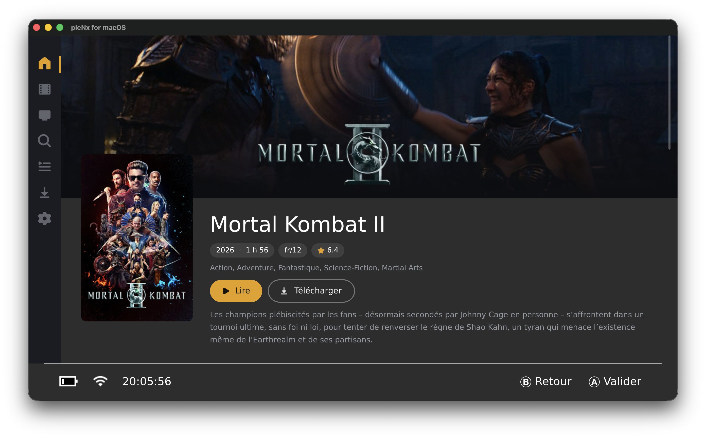
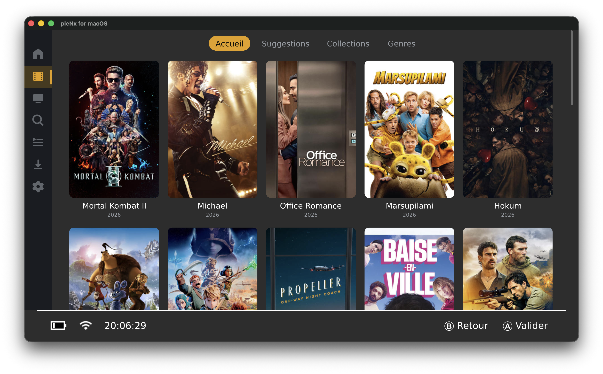
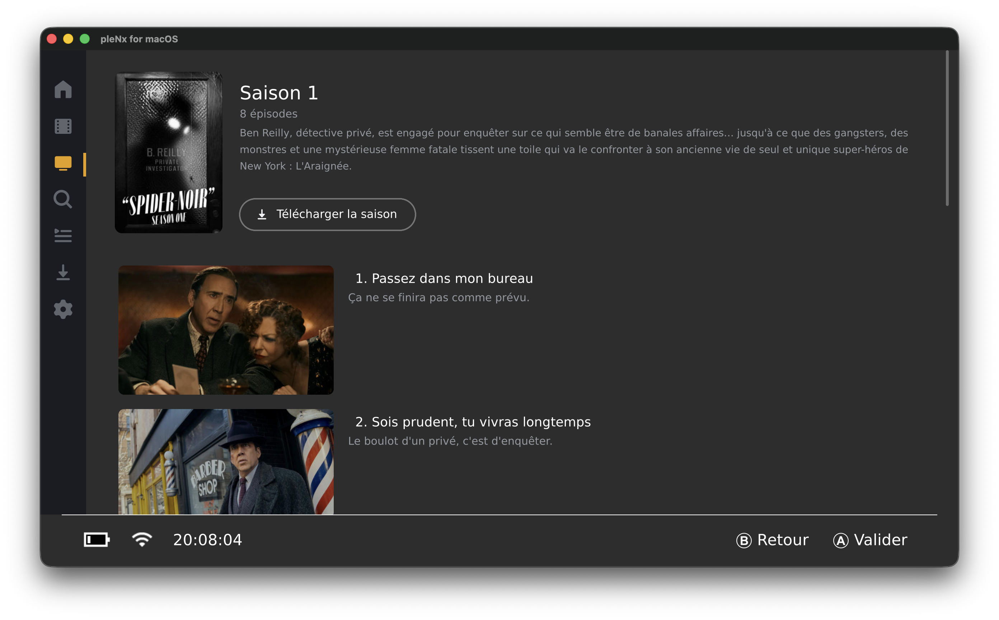
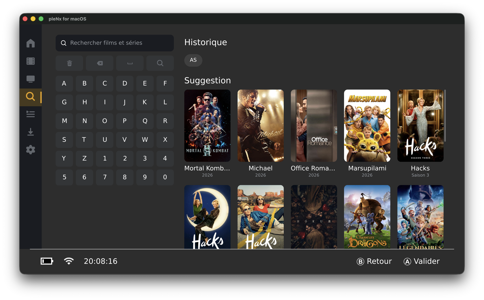
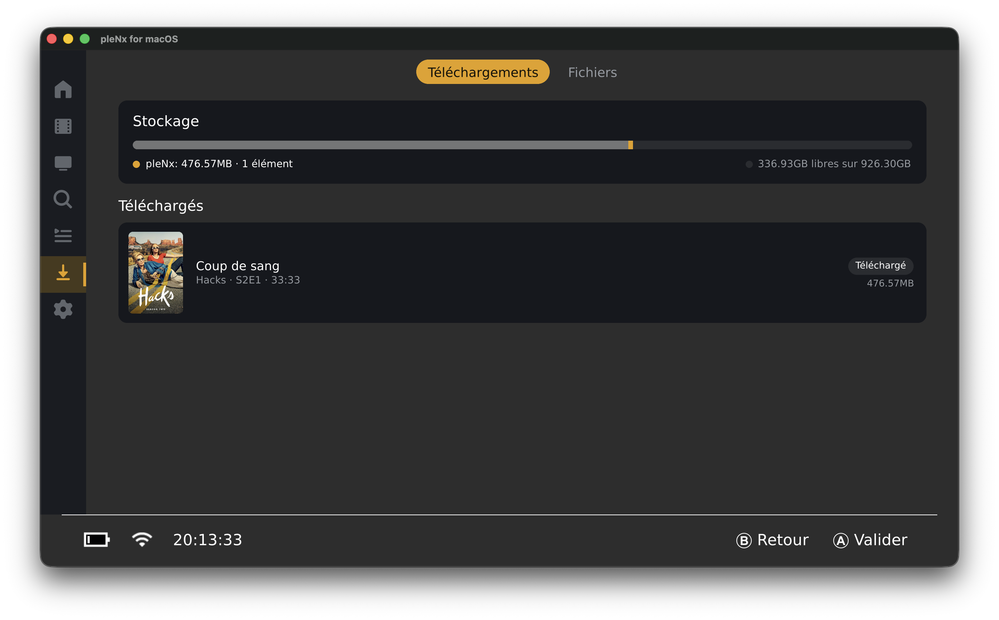

<div align="center">



**🎮📺 - A third-party native, controller-first Plex client for Nintendo Switch.**

Browse and play your movies and shows from your Plex Media Server, with a fully
native interface designed for the gamepad. Also (should) runs on Windows,
macOS, Linux, PS4 and PS Vita.

[](https://github.com/thcolin/plenx/actions/workflows/build.yaml)
[](https://github.com/thcolin/plenx/releases/latest)
[](https://nightly.link/thcolin/plenx/workflows/build.yaml/dev)
[](https://github.com/sponsors/thcolin)

</div>

> [!NOTE]
> pleNx is a fork of [Switchfin](https://github.com/dragonflylee/switchfin) (Nitendo Switch Jellyfin
> client) fully migrated to the **Plex API**, with a redesigned interface.
> It is a third-party project, not affiliated with or endorsed by Plex.

---

## Screenshots

<div align="center">

| Home | Movie | Library |
|:---:|:---:|:---:|
|  |  |  |
| **Season** | **Search** | **Downloads** |
|  |  |  |

</div>

## Features

- **Sign in with Plex** — type a 4-character code on [plex.tv/link](https://plex.tv/link),
  then pick your server and your Plex Home profile (PIN-protected profiles supported).
- **Home mirrors your server** — Continue Watching followed by every hub configured on
  your Plex, in the order your server returns them.
- **Libraries in the sidebar** — one entry per library, each with Home, Suggestions,
  Collections and Genres views, and server-side sorting.
- **Rich detail pages** — full-bleed backdrop with the title logo, cast with full
  **person pages** (filmography), and related rows pulled from your server.
- **Season pages** — artwork, episode count and synopsis, with one-tap
  **full-season download**.
- **Quick actions on any poster** — press <kbd>X</kbd> (or long-press): go to show,
  go to season, mark watched, download.
- **Plex Watchlist** — browse your account watchlist in the sidebar, add or remove
  any movie or show from its detail page or the quick actions menu.
- **Playback with MPV** — direct play and universal transcode (HLS), resume, chapters,
  external and embedded subtitles, audio track selection.
- **Offline downloads** for playback without a connection (original quality).
- **Remote file browser** for WebDAV / Apache / Nginx / FTP / SFTP servers.
- **External drive support on Switch** via [libusbhsfs](https://github.com/DarkMatterCore/libusbhsfs).
- **Available in 14 languages.**

> [!TIP]
> MPV decodes H.264, H.265, VP8, VP9 and AV1 video; Opus, FLAC, MP3, AAC, AC-3, E-AC-3,
> TrueHD and DTS audio; and SRT, VTT, SSA/ASS and DVDSUB subtitles.

## Install on Nintendo Switch

1. Copy `pleNx.nro` to `sdmc:/switch/` and launch it from the homebrew menu.
2. On first launch in **applet mode**, pleNx offers to install a HOME menu tile: press
   the button, confirm, and the app relaunches as a regular title with full memory
   (required for video playback). Alternatively, hold <kbd>R</kbd> while launching any
   game (title takeover).
3. Sign in with your Plex account at [plex.tv/link](https://plex.tv/link) and enjoy.

> [!IMPORTANT]
> Video playback needs full-memory mode. Applet mode is fine for browsing, but install
> the HOME tile (or use title takeover) before starting a movie.

Desktop builds for Windows, macOS and Linux are attached to every
[release](https://github.com/thcolin/plenx/releases/latest), with nightly artifacts on
[nightly.link](https://nightly.link/thcolin/plenx/workflows/build.yaml/dev).

## Controls during playback

| Gamepad | Keyboard | Action |
|:---:|:---:|---|
| A | `space` | Play / Pause |
| B | `esc` | Stop |
| Y | `o` | Toggle OSD |
| X | `f4` | Menu |
| R / L | `]` / `[` | Seek forward / back |
| + | `f1` | Video profile |
| R stick | `f2` | Video quality |
| L stick | `f3` | Playback speed |

## System requirements

- **Nintendo Switch** with Atmosphère CFW (full-memory mode for playback)
- **Windows** 7 or later with DirectX 11.1 support
- **macOS** 10.15 or later (Intel or Apple Silicon)
- **Linux** Flatpak (x86_64 / arm64v8) with OpenGL 3 support

## FAQ

**Subtitles don't show up?**
Drop any TrueType font at `sdmc:/switch/pleNx/subfont.ttf`.

**macOS won't open the app?**
Clear the quarantine attribute:

```shell
sudo xattr -rd com.apple.quarantine /Applications/pleNx.app
```

**How do I enable an external drive on Switch?**
Set `ums` in `config.json`:

```json
{
  "setting": {
    "ums": true
  }
}
```

## Building from source

pleNx is C++17, built on [borealis](https://github.com/natinusala/borealis) for the UI
and [mpv](https://github.com/mpv-player/mpv) for playback.

```shell
git clone https://github.com/thcolin/plenx.git --recurse-submodules --shallow-submodules
```

### Nintendo Switch

All-in-one Docker script (mirrors the CI):

```shell
./scripts/build-switch.sh                  # deko3d driver (recommended)
DRIVER=opengl ./scripts/build-switch.sh    # OpenGL fallback
```

Or with a local [devkitPro](https://devkitpro.org/wiki/Getting_Started) toolchain:

```shell
sudo dkp-pacman -S switch-dev switch-glfw switch-libwebp switch-curl switch-libmpv
cmake -B build_switch -DPLATFORM_SWITCH=ON
make -C build_switch pleNx.nro -j$(nproc)

# debug over the network
nxlink -a <SWITCH_IP> -p pleNx/pleNx.nro -s pleNx.nro --args -d -v
```

### Desktop (macOS / Linux)

```shell
cmake -B build_desktop -G Ninja -DPLATFORM_DESKTOP=ON
cmake --build build_desktop
```

### Windows (MinGW64)

```shell
pacman -S ${MINGW_PACKAGE_PREFIX}-cc ${MINGW_PACKAGE_PREFIX}-ninja ${MINGW_PACKAGE_PREFIX}-cmake
cmake -B build_mingw -G Ninja -DPLATFORM_DESKTOP=ON
cmake --build build_mingw
```

> [!TIP]
> The desktop UI test harness in `scripts/ui-audit/` drives the app with keyboard events
> and captures window screenshots; replayable scenarios live alongside it. On macOS, grant
> your terminal Accessibility and Screen Recording permissions first.

Migration notes from Jellyfin to Plex are documented in
[PLEX_MIGRATION.md](PLEX_MIGRATION.md), and the visual redesign in
[UI_REDESIGN.md](UI_REDESIGN.md).

## Support

If pleNx is useful to you, consider [sponsoring the project](https://github.com/sponsors/thcolin) —
it directly funds development time and devices to test on.

## Acknowledgements

pleNx stands on the shoulders of the homebrew and open-source community:

- **[@dragonflylee](https://github.com/dragonflylee)** for [Switchfin](https://github.com/dragonflylee/switchfin), the Jellyfin client pleNx is forked from
- **[@xfangfang](https://github.com/xfangfang)** for [wiliwili](https://github.com/xfangfang/wiliwili)
- [@natinusala](https://github.com/natinusala) and XITRIX for [borealis](https://github.com/natinusala/borealis)
- [@devkitPro](https://github.com/devkitPro) and switchbrew for [libnx](https://github.com/switchbrew/libnx)
- [@proconsule](https://github.com/proconsule) for [nxmp](https://github.com/proconsule/nxmp)
- [@averne](https://github.com/averne) for the [FFmpeg](https://github.com/averne/FFmpeg) hwaccel backend and the deko3d backend of mpv
</content>
</invoke>
